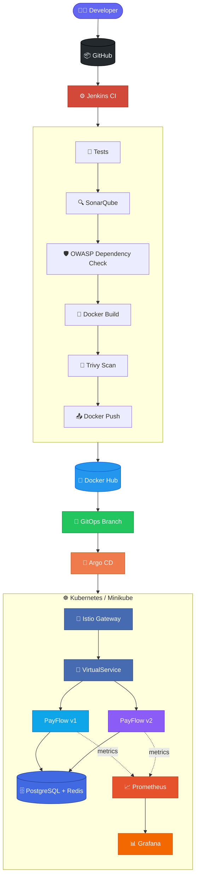
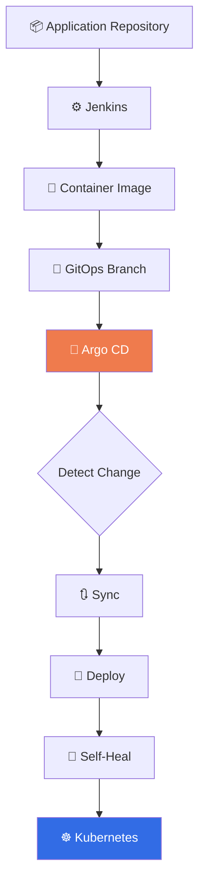
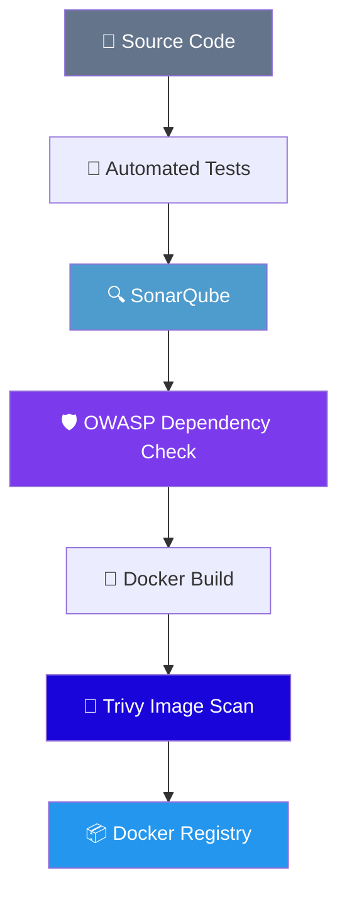
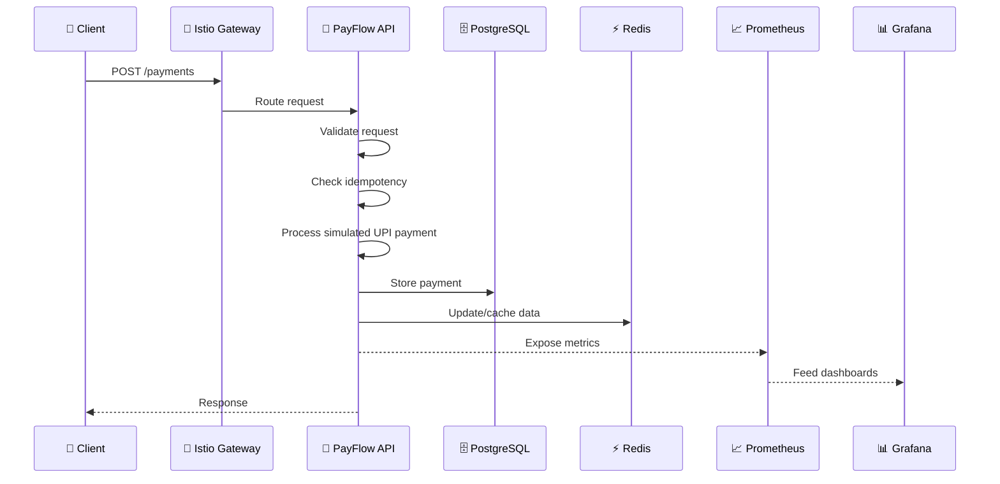

<div align="center">

# 💳 PayFlow
### Cloud-Native UPI Payment Processing Platform

**From code to cloud, fully automated.** 🚀


</div>

<br>

PayFlow is a simulated **UPI payment processing platform** built with FastAPI, PostgreSQL, Redis, Docker and Kubernetes — backed by a complete DevOps delivery pipeline spanning Jenkins, SonarQube, OWASP Dependency Check, Trivy, Argo CD, Helm, Istio, Prometheus and Grafana.

The project demonstrates an end-to-end DevOps workflow covering **CI, DevSecOps, containerization, Kubernetes deployment, GitOps, service-mesh traffic management, and monitoring/alerting.**

<br>

## 🎯 Project Goals

- 🏗️ Build a realistic backend payment-processing service
- 🐳 Containerize the application using Docker
- 🔐 Automate CI and security checks with Jenkins
- ☸️ Deploy the application to Kubernetes using Helm
- 🔄 Implement GitOps with Argo CD
- 🔀 Demonstrate v1/v2 traffic management with Istio
- 📊 Monitor application and Kubernetes metrics with Prometheus and Grafana
- 🚨 Demonstrate payment failure-rate alerting

<br>

## 🏗️ Architecture



<br>

## ⭐ Key Features

<table>
<tr>
<td valign="top" width="50%">

### 🧩 Application
- FastAPI REST API
- Simulated UPI payment processing
- PostgreSQL persistence
- Redis caching
- Payment status tracking
- Idempotency-key support
- Health endpoint
- Prometheus metrics endpoint

### 🔐 DevSecOps
- Jenkins CI pipeline
- Automated tests
- SonarQube code-quality analysis
- OWASP Dependency Check
- Trivy container vulnerability scanning
- Multi-stage Docker build
- Non-root application container

</td>
<td valign="top" width="50%">

### ☸️ Kubernetes
- Minikube multi-node cluster
- Helm deployment
- Kubernetes Services
- Health/readiness probes
- Multiple API replicas
- PostgreSQL and Redis workloads

### 🌿 GitOps
- GitHub GitOps branch
- Argo CD
- Automatic synchronization
- Self-healing
- Declarative Kubernetes deployment

### 🔀 Istio
- Istio Gateway
- VirtualService / DestinationRule
- v1/v2 application subsets
- Weighted traffic routing
- Progressive rollout & rollback

### 📊 Observability
- Prometheus metrics + ServiceMonitor
- Grafana dashboards
- Payment & failure-rate metrics
- Grafana alert rule

</td>
</tr>
</table>

> ℹ️ Email notification delivery and ELK/Kibana centralized logging were intentionally left outside the final project scope.

<br>

## 🧰 Technology Stack

| Category | Technology |
|---|---|
| 🐍 **Backend** | Python, FastAPI |
| 🗄️ **Database** | PostgreSQL |
| ⚡ **Cache** | Redis |
| 🧪 **Testing** | Pytest |
| 🐳 **Containerization** | Docker, Docker Compose |
| ⚙️ **CI** | Jenkins |
| 🔍 **Code Quality** | SonarQube |
| 🛡️ **Dependency Security** | OWASP Dependency Check |
| 🔎 **Image Security** | Trivy |
| 📦 **Container Registry** | Docker Hub |
| ☸️ **Orchestration** | Kubernetes / Minikube |
| 📦 **Packaging** | Helm |
| 🔄 **GitOps** | Argo CD |
| 🔀 **Service Mesh** | Istio |
| 📈 **Metrics** | Prometheus |
| 📊 **Visualization** | Grafana |
| 🌿 **Source Control** | Git / GitHub |

<br>

## 📁 Project Structure

```
payflow/
├── app/
│   ├── main.py
│   ├── routes/
│   ├── services/
│   ├── models/
│   ├── database.py
│   └── ...
│
├── alembic/
│   └── migrations
│
├── helm/
│   └── payflow/
│       ├── Chart.yaml
│       ├── values.yaml
│       └── templates/
│
├── infra/
│   ├── istio/
│   └── monitoring/
│
├── tests/
│
├── Dockerfile
├── docker-compose.yml
├── Jenkinsfile
├── requirements.txt
└── README.md
```

<br>

## 🚀 Getting Started

### 1️⃣ Clone

```bash
git clone https://github.com/rithuraj6/payflow.git
cd payflow
```

### 2️⃣ Run locally with Docker Compose

```bash
docker compose up --build
```

The local PayFlow API can be exposed on the configured application port.

📖 **Swagger / OpenAPI:** `http://localhost:<port>/docs`

<br>

## ☸️ Kubernetes Deployment

The project uses a Helm chart for Kubernetes deployment.

```bash
helm lint helm/payflow
```

**Install:**

```bash
helm install payflow ./helm/payflow \
  --namespace default
```

**Check:**

```bash
kubectl get pods
kubectl get services
```

<br>

## 🔄 CI/CD Workflow

```mermaid
flowchart LR
    A[👨‍💻 Git Push] --> B[⚙️ Jenkins]
    B --> C[✅ Checkout]
    C --> D[🧪 Python Tests]
    D --> E[🔍 SonarQube]
    E --> F[🛡️ OWASP Check]
    F --> G[🐳 Docker Build]
    G --> H[🔎 Trivy Scan]
    H --> I[📤 Docker Push]
    I --> J[(🐳 Docker Hub)]
    J --> K[🌿 GitOps Update]
    K --> L[🔄 Argo CD]
    L --> M[☸️ Kubernetes]

    style A fill:#6366f1,color:#fff
    style B fill:#D24939,color:#fff
    style J fill:#2496ED,color:#fff
    style L fill:#EF7B4D,color:#fff
    style M fill:#326CE5,color:#fff
```



> 💡 **Design principle:** CI builds and validates the application, while Argo CD handles Kubernetes deployment from the GitOps state.

<br>

## 🌿 GitOps Workflow



This separates application build responsibilities from deployment state management.

<br>

## 🔀 Istio Traffic Management

PayFlow contains two application versions: **PayFlow v1** and **PayFlow v2**.

Istio uses a `DestinationRule` to define subsets:

```yaml
subsets:
  - name: v1
    labels:
      version: v1

  - name: v2
    labels:
      version: v2
```

A `VirtualService` controls the traffic distribution:

```yaml
http:
  - route:
      - destination:
          host: payflow-payflow
          subset: v1
        weight: 90

      - destination:
          host: payflow-payflow
          subset: v2
        weight: 10
```

### 📈 Progressive Traffic Rollout

| Stage | v1 | v2 |
|:---:|:---:|:---:|
| 1 | 🟦🟦🟦🟦🟦🟦🟦🟦🟦🟦 100% | — |
| 2 | 🟦🟦🟦🟦🟦🟦🟦🟦🟦⬜ 90% | 🟪 10% |
| 3 | 🟦🟦🟦🟦🟦🟦🟦⬜⬜⬜ 70% | 🟪🟪🟪 30% |
| 4 | 🟦🟦🟦🟦🟦⬜⬜⬜⬜⬜ 50% | 🟪🟪🟪🟪🟪 50% |
| 5 | — | 🟪🟪🟪🟪🟪🟪🟪🟪🟪🟪 100% |

⏪ **Rollback:** `100% v2 → 100% v1`

> ⚠️ Traffic weights represent routing proportions over requests; a small test sample will not necessarily produce exact percentages.

<br>

## 📊 Monitoring

PayFlow exposes Prometheus metrics through **`/metrics`**, discovered via a Kubernetes `ServiceMonitor`.


**Payment failure-rate query:**

```promql
100 *
sum(increase(payflow_payments_total{status="FAILED"}[15m]))
/
clamp_min(sum(increase(payflow_payments_total[15m])), 1)
```

This calculates the percentage of failed payments over the selected 15-minute window.

<br>

## 🚨 Alerting

**Alert rule:** `PayFlow High Failure Rate`

| Property | Value |
|---|---|
| 🎯 Condition | `WHEN Query A IS ABOVE 50` |
| ⏱️ Evaluation interval | Every 1 minute |
| ⏳ Pending period | 1 minute |

> ℹ️ Email notification delivery was not included in the final project demonstration.

<br>

## 🔐 Security Pipeline



The Docker runtime also uses a **dedicated non-root user**.

<br>

## 🩺 Health & Troubleshooting

**Health & Metrics**
```bash
GET /health
GET /metrics
```

**Kubernetes**
```bash
kubectl get pods
kubectl get services
kubectl describe pod <pod-name>
kubectl logs <pod-name>
kubectl get events --sort-by=.lastTimestamp
```

**Helm**
```bash
helm list
helm status payflow
helm history payflow
helm get values payflow
```

**Argo CD**
```bash
argocd app get payflow
argocd app sync payflow
argocd app history payflow
```

**Istio**
```bash
istioctl analyze
istioctl proxy-status
istioctl proxy-config clusters <pod-name>
```

<br>

## 🧪 Example Payment Flow



<br>

## 📌 Interview Talking Points

<table>
<tr>
<td>✅ Linux & containerized app operations</td>
<td>✅ Docker image optimization</td>
</tr>
<tr>
<td>✅ CI/CD pipeline design</td>
<td>✅ DevSecOps security gates</td>
</tr>
<tr>
<td>✅ Kubernetes deployments & services</td>
<td>✅ Helm chart management</td>
</tr>
<tr>
<td>✅ GitOps with Argo CD</td>
<td>✅ Service-mesh traffic management</td>
</tr>
<tr>
<td>✅ Progressive application rollout</td>
<td>✅ Rollback strategies</td>
</tr>
<tr>
<td>✅ Prometheus metrics</td>
<td>✅ Grafana dashboards & alerting</td>
</tr>
<tr>
<td colspan="2" align="center">✅ Application troubleshooting</td>
</tr>
</table>

<br>

## 🎯 Project Outcome

<div align="center">

**Code → Test → Secure → Build → Containerize → Publish → GitOps → Deploy → Route → Monitor → Alert**

</div>

PayFlow demonstrates an end-to-end DevOps workflow. The objective is not simply to deploy an API, but to demonstrate how a modern DevOps engineer takes an application from source code to an **observable Kubernetes workload**.

<br>

---

<div align="center">

## 👨‍💻 Author

**Rithu Raj R**
*DevOps Engineer | Python Developer*


</div>
